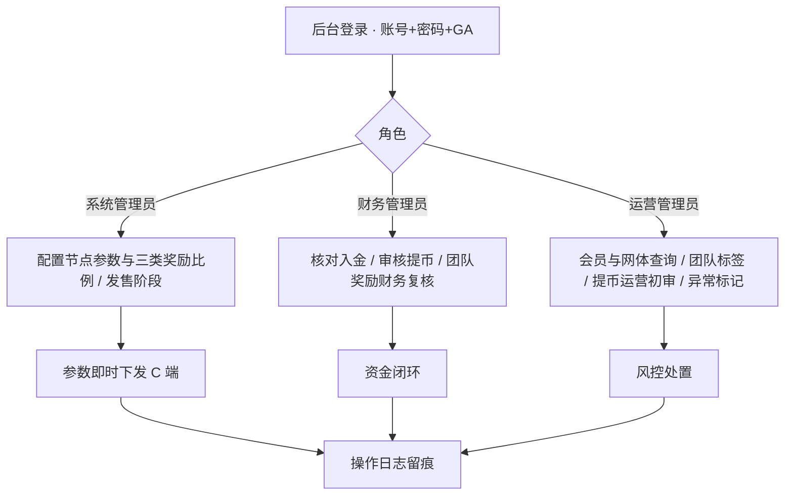
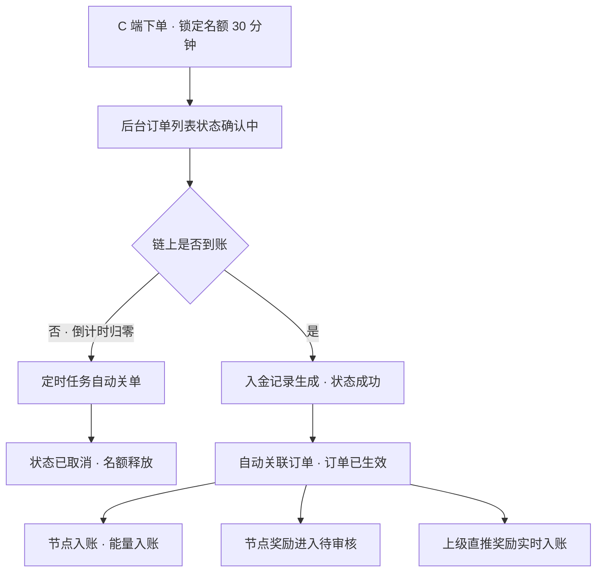
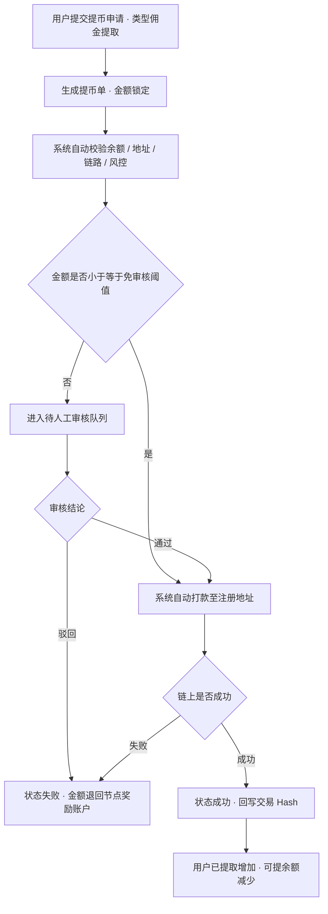
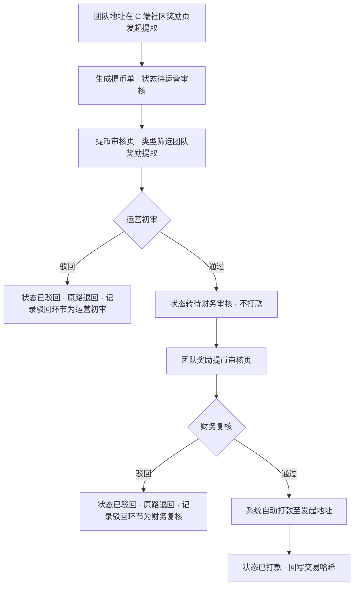

# PRD — A2 节点 DAPP · 管理后台


| 字段   | 内容                                                                                                                                             |
| ---- | ---------------------------------------------------------------------------------------------------------------------------------------------- |
| 文档版本 | v3.0（三类奖励 / 两级审核 / 团队标签 / 会员树重做 / 个人中心）                                                                                                        |
| 状态   | 待评审                                                                                                                                            |
| 更新日期 | 2026-09-06                                                                                                                                     |
| 负责人  | 产品                                                                                                                                             |
| 依据   | 《节点 DAPP 技术开发需求文档》§五–§十 + `A2_PRD.md`（C 端）+ 后续走查反馈                                                                                             |
| 原型   | [https://leo5409.github.io/botchain-prototype/a2-admin.html](https://leo5409.github.io/botchain-prototype/a2-admin.html) · **17 个页面 + 25 个弹框** |
| 关联文档 | `A2_PRD.md`（C 端 v3.2）                                                                                                                          |


---


## 一、定位与角色

管理后台是 A2 节点 DAPP 的**运营中枢**：C 端的所有可变内容（阶段、价格、每份能量数值、三类奖励比例、收款地址）都在这里配置，所有资金动作（入金核对、提币审核打款）都在这里落地。


| 角色    | 权限范围                                      |
| ----- | ----------------------------------------- |
| 超级管理员 | 系统全部功能，含权限分配、系统参数、高危配置                    |
| 财务管理员 | 入金记录、节点订单、提币审核、**团队奖励提币审核（财务复核）**、打款记录    |
| 运营管理员 | 会员管理、团队标签、网体查询、数据导出、账户异常标记、**提币审核（运营初审）** |
| 系统管理员 | 节点参数、发售阶段、收款地址                            |


**登录方式固定为「账号 + 密码 + Google 验证码」三要素，不可关闭**；登录失败 5 次锁定 30 分钟；会话闲置 30 分钟自动登出。

---


## 二、功能地图


| 分组    | 页面                 | 核心职责                                                 |
| ----- | ------------------ | ---------------------------------------------------- |
| 会员与社区 | **F-01 会员管理**      | 会员台账、推荐关系、团队编号与标签、持有节点与能量、可提节点奖励、账户与激活状态             |
|       | **F-01d 团队标签管理**   | 团队编号的可读标签，改标签同步刷新团队下全部成员；新增团队并指定所属社区                 |
| 财务管理  | **F-01b 社区编号管理**   | 维护社区编号与社区长，团队编号归属社区，变更留痕                             |
|       | **F-01c 会员树查询**    | 上下双向查询网体：向上追溯上级链路 + 一次展开多层下级                         |
|       | **F-02 入金记录**      | 多链到账识别、与订单自动关联，链上到账即成功                               |
|       | **F-03 节点订单**      | 订单全生命周期、锁单状态、能量与奖励触发                                 |
|       | **F-03b 直推返佣流水**   | 逐笔返佣台账，可追溯至源订单                                       |
|       | **F-04 提币审核**      | 两种类型：佣金提取（小额免审核 / 人工审核 → 打款）；团队奖励提取（**运营初审**，转待财务审核） |
|       | **F-04b 团队奖励提币审核** | 两级审核的**第二级**：财务复核已通过初审的申请 → 打款                       |
| 节点与参数 | **F-05 节点参数**      | 档位原价 / 每份能量数值 / **节点、直推、团队三类奖励比例** / 启用停用 + 规则变更记录     |
|       | **F-05b 系统参数**     | 提币规则 / 风控阈值 / 购买份数上限                                 |
|       | **F-06 发售阶段**      | 阶段日期 / **能量加成比例** / 名额 / 平台认购 / 手动置罄                 |
|       | **F-07 收款地址**      | 8 语言 × 3 链共 24 个收款地址（**只读**，合约控制）                    |
| 系统    | **F-11 个人中心**      | 当前账号的信息、改密、GA 重置、登录记录、退出登录                           |
|       | **F-08 管理员与权限**    | 4 角色、账号、Google 验证器、20 项权限                            |
|       | **F-09 操作日志**      | 参数与关键操作留痕（修改前 / 修改后）                                 |
|       | **F-10 后台登录**      | 三要素登录示意                                              |


---


## 三、核心业务规则（后台视角）


### 3.1 计算口径

```
订单实付 = 节点原价 × 购买份数                    ← C 端原价实收实付
基础能量 = 档位每份能量数值 × 购买份数        ← 固定值，与实付金额无关
实发能量 = 基础能量 × (1 + 当期能量加成比例)        ← 原折扣转化为能量加成

节点奖励 = 订单实付 × 档位节点奖励比例             ← 认购时一次性，发给购买者本人
直推奖励 = 下级订单实付 × 档位直推奖励比例          ← 发给直接上级，实时入账
团队奖励 = 团队业绩 × 档位团队奖励比例 − 下级已领取（级差制）

可提节点奖励 = 三类奖励累计 − 提币中 − 已提取
```

**各档位三类奖励比例（节点参数页配置，各档位独立）**


| 档位   | 原价       | 每份能量数值 | 节点奖励  | 直推奖励  | 团队奖励  |
| ---- | -------- | ----- | ----- | ----- | ----- |
| A 节点 | 1,000 U  | 1,500 | 1.00% | 5.00% | 2.00% |
| B 节点 | 5,000 U  | 10,000 | 1.50% | 5.00% | 4.00% |
| C 节点 | 10,000 U | 25,000 | 2.00% | 5.00% | 6.00% |
| D 节点 | 30,000 U | 90,000 | 3.00% | 5.00% | 8.00% |


**各期能量加成（发售阶段页配置，各期独立）**


| 期次   | 能量加成     | A 实发  | B 实发   | C 实发   | D 实发    |
| ---- | -------- | ----- | ------ | ------ | ------- |
| 阶段 1 | **+25%** | 1,875 | 12,500 | 31,250 | 112,500 |
| 阶段 2 | **+20%** | 1,800 | 12,000 | 30,000 | 108,000 |
| 阶段 3 | **+15%** | 1,725 | 11,500 | 28,750 | 103,500 |
| 阶段 4 | **+10%** | 1,650 | 11,000 | 27,500 | 99,000  |


> C 端以「**能量 125% = 实发值**」的形式展示当期系数与结果，不拆分基础与加成两个数字。

**示例会员对账**（`0xE240a1……b428d2`）：累计推荐收益 `1,750.00` − 提币中 `300.00` − 已提取 `920.00` = **可提节点奖励** `530.00`

> 会员详情**不再展示「能量来源」明细表**（各档位实付 × 倍数 = 能量）。能量后续开放认购后将有独立的**能量认购流水**，届时另行定义。


### 3.2 参数生效原则

- **节点参数、奖励比例、阶段配置修改立即对新订单生效**；已生成订单按下单时的**价格与奖励比例快照**结算，不受影响。
- **收款地址修改立即对新订单生效**；已生成订单仍按下单时地址匹配。
- 所有高危配置（收款地址、节点原价、每份能量数值、三类奖励比例、阶段名额）修改需填写原因，并记录**修改前 / 修改后值、操作人、时间、IP**。


### 3.3 订单锁单与超时

- 用户下单即锁定名额，锁单时长 **30 分钟**（固定规则，不作为后台可配项）。
- 后台订单列表对锁单中的订单显示**剩余时间**；超时由定时任务自动关单并释放名额，状态置「已取消」并标注「超时未入金 · 名额已释放」。
- **用户无法主动取消订单**，订单只由超时自动关闭。


### 3.4 账户异常

- 链上无「禁用」概念，故采用**登录拦截**：标记异常后该钱包无法登录，C 端仅显示「登入异常，请联系客服」。
- 历史订单、节点、能量与奖励余额**全部保留**，可提余额锁定。
- 标记与恢复均需填写原因，记入操作日志。


### 3.5 三类奖励的发放与提取规则

> **本节为固定规则，由后端按本 PRD 实现，不在后台做成配置项。**
> 后台「节点参数」页只配置三类奖励的**比例**（各档位可独立设置），其余规则一律不可调。


| 项          | 规则                                                                                                                                    |
| ---------- | ------------------------------------------------------------------------------------------------------------------------------------- |
| **激活条件**   | 需持有任一节点方可获得奖励。未激活会员产生的**直推与团队奖励暂存不发放**，激活后自动补发；**节点奖励不受此限制**（购买行为本身即完成激活）                                                             |
| **节点奖励**   | 认购时一次性发给**购买者本人** = 本单实付 × 本档节点奖励比例。发放**固定需人工审核**：订单生效后进入**待审核**状态，审核通过才计入「可提节点奖励」余额，驳回则不发放并记录原因。订单取消或超时未入金**不产生待审核记录**；已发放后发生退单需人工冲正 |
| **直推奖励**   | 下级订单实付 × 本档直推奖励比例，发给**直接上级**，订单生效即**实时入账**，无需审核                                                                                       |
| **团队奖励**   | 团队业绩 × 本档团队奖励比例 − 下级已领取（**级差制**），同一笔业绩不重复发放                                                                                           |
| **入账账户**   | 三类奖励均计入会员的「可提节点奖励」余额，与节点认购的**能量账户相互独立**                                                                                               |
| **异常账户**   | 会员被标记异常时，**冻结其未提取的奖励**；历史已提取部分不追回                                                                                                     |
| **提取方式**   | 节点奖励与直推奖励走「**提币审核**」（类型：佣金提取，支持小额免审核，**单级审核**）；团队奖励走**两级审核**，见下                                                                       |
| **比例变更生效** | 修改比例**立即对新订单生效**；已产生的奖励按**发生时的比例快照**结算，不受后续修改影响                                                                                       |


**团队奖励提币的两级审核**

团队奖励提取**不适用小额免审核**，无论金额大小均需两级人工审核：


| 环节     | 页面                    | 处理人     | 通过后                      | 驳回后                         |
| ------ | --------------------- | ------- | ------------------------ | --------------------------- |
| 发起     | C 端「社区奖励」             | 团队地址持有人 | 状态 → **待运营审核**           | —                           |
| ① 运营初审 | 后台「提币审核」（类型筛选：团队奖励提取） | 运营      | 状态 → **待财务审核**，**不打款**   | 金额原路退回团队可提取余额，记录驳回环节为「运营初审」 |
| ② 财务复核 | 后台「团队奖励提币审核」          | 财务      | 自动打款并回写交易哈希，状态 → **已打款** | 金额原路退回，记录驳回环节为「财务复核」        |


```
待运营审核 ──运营通过──▶ 待财务审核 ──财务通过──▶ 已打款
     │                        │
     └──运营驳回──┐    ┌──财务驳回──┘
                  ▼    ▼
              已驳回（金额原路退回，记录驳回环节与原因）
```

> 「团队奖励提币审核」页只列出**已通过运营初审**的申请，并显示初审人与初审时间；
> 「提币审核」页则同时列出两种类型，团队奖励类的审核方式标为「人工审核（两级）」。
>
> **C 端状态映射**：后台的「待运营审核」与「待财务审核」在 C 端**统一显示为「提币中」**，用户不感知内部审到哪一级；「已打款」→「成功」，「已驳回」→「失败」。

**节点奖励的状态流**

```
订单生效 → 待审核 → 审核通过 → 计入可提节点奖励余额
                 → 审核驳回 → 不发放（记录驳回原因）
订单取消 / 超时未入金 → 不产生待审核记录
```

> **待补**：节点奖励改为「审核后发放」后，后台目前**没有对应的审核入口**（提币审核管的是提币，节点订单页无奖励审核动作）。需新增一个待审核列表或在节点订单页增加审核栏，否则奖励会一直停留在待审核。见 §九 第 1 条。


### 3.6 社区 / 团队 / 会员三级归属

```
社区编号（A1-01）  ⊃  团队编号（T-A1-001 …）  ⊃  会员地址
```

- **一个社区可包含多个团队**，每个团队**必须且只能归属一个社区**。
- **团队标签**是团队编号的可读名称（如 `T-A1-001` → 「越南一区」）。
- 成员的标签**由其所属团队编号决定，不单独维护**；修改团队标签后，该团队下全部成员在会员管理、会员树查询中的标签**同步更新**，成员的团队编号、推荐关系与业绩数据不受影响。
- 团队编号在全系统内**唯一**，创建后不可修改；调整归属社区需到「社区编号管理」变更。

---


## 四、功能需求


### 4.1 F-01 会员管理

**统计卡**：会员总数 / 已购节点会员 / 异常账户 / 可提节点奖励合计

**筛选**：钱包地址、推荐人地址、持有节点数、持有档位、账户状态、激活状态、注册时间

**列表字段**（14 列）


| 字段                    | 说明                                      |
| --------------------- | --------------------------------------- |
| 钱包地址 / 推荐人            | 前 6 + 后 6                               |
| **团队编号**              | 如 `T-A1-001`，可在列表直接修改                   |
| **团队标签**              | 由所属团队决定，未设置时显示灰色「未设置」；无团队编号时显示「—」       |
| 持有节点 / 档位分布 / 累计能量    | 如 `6` / `A2 · B2 · C1 · D1` / `167,000` |
| 直推人数 / 团队人数 / 团队业绩(U) | 网体统计                                    |
| 可提节点奖励(USDT)          | 见 §3.1                                  |
| 账户状态 / 激活状态           | 正常·异常 / 已激活·未激活                         |
| 操作                    | 详情 / 团队编号 / 标记异常（异常账户为「恢复正常」）           |


**弹框 · 会员详情**：基础信息（地址 / 推荐人 / 推荐码 / 绑定方式与时间 / 账户与激活状态）+ 资产信息（持有节点 / 累计购买 / 累计能量 / 直推团队 / 团队业绩 / **团队编号 / 团队标签**）+ **节点奖励对账表**（累计推荐收益 − 提币中 − 已提取 = 可提节点奖励）。**不含能量来源表**。

**弹框 · 标记账户异常**：展示影响说明、当前状态、保留的资产，要求选择原因并填备注。

**弹框 · 修改团队编号**：展示当前编号与影响成员数，填写新编号与变更原因，记入操作日志。

### 4.1b F-01b 社区编号管理

- **统计卡**：社区编号总数 / 已归属地址 / 社区业绩合计 / 停用社区。
- **列表**：社区编号 / 社区长地址 / **包含团队编号（含团队标签）** / 社区地址数 / 社区业绩 / 状态 / 创建时间 / 操作。
- **弹框 · 新增/编辑社区编号**：编号 / 状态 / 社区长地址 / 归属团队编号 / 名称备注。
- **弹框 · 变更记录**：逐条展示变更项与修改前后值。


### 4.1c F-01c 会员树查询（上下双向）

> **设计动因**：网体可达数百层、数十万地址，既不能一次性铺开，也不能只支持向下逐层点开 —— 运营常见诉求是「**这个地址的上级是谁、往上还有几级**」。

**页面构成**：统计卡（查询起点 / 下级层数 / 团队地址总数 / 团队业绩）→ 筛选条 → 网体结构卡

**三种查询方式**


| 方式       | 操作                                            | 结果                            |
| -------- | --------------------------------------------- | ----------------------------- |
| **向上追溯** | 顶部「上级链路」面包屑，展示「顶端 › 第 1 级 › … › 当前」；点任意一级直接跳转 | 一眼看清当前节点在网体中的深度与完整推荐链         |
| **向下展开** | 「展开层数」下拉：1 层 / 2 层 / 3 层 / 全部层级               | 一次展开多层，表格按层缩进并标注「第 N 层」       |
| **直接定位** | 起点钱包地址输入框（支持模糊匹配 + 回车）                        | 自动定位并展开该地址的上级链路，提示「上级链路共 N 级」 |


**辅助操作**：`⤒ 回到起点`、`↑ 上一级`、「以此为起点」（把某个下级设为新的查询起点）。

**列表字段**（12 列）：层级 / 钱包地址（按层缩进，有下级者可点）/ **上级**（可点跳转）/ 团队编号 / 团队标签 / 档位分布 / 持有节点 / 直推 / 团队人数 / 团队业绩 / 激活状态 / 操作。

**当前节点信息条**：当前节点 / 上级 / 团队与标签 / 档位分布 / 直推与团队人数 / 团队业绩 / 本次展开层数与地址数。

> **后端要求**：向上追溯需要后端提供「给定地址 → 到根的完整链路」的能力（物化路径或递归查询），**不能由前端遍历**，见 §九 第 2 条。


### 4.1d F-01d 团队标签管理

**统计卡**：团队编号总数 / 已设置标签 / 未设置标签 / **关联社区数**

**筛选**：团队编号、团队标签、所属社区、标签状态

**列表**：团队编号 / 团队标签 / 所属社区 / 团队长地址 / 成员数 / 团队业绩 / 标签更新人 / 标签更新时间 / 操作（编辑标签 · 变更记录）

**弹框 · 新增团队标签**：团队编号 / **所属社区**（下拉，来自社区编号管理）/ 团队标签 / 团队长钱包地址 / 备注。提示团队编号全系统唯一、保存后不可修改，调整归属社区需到社区编号管理。

**弹框 · 编辑团队标签**：展示团队编号、所属社区（含该社区下团队数）、团队长地址、当前标签、**影响成员数**；填写新标签与变更原因。**明示保存后该团队下全部成员标签同步更新**，并提供「查看受影响成员」。

**弹框 · 受影响成员预览**：钱包地址 / 会员档位 / 当前标签 / 变更后标签 / 加入团队时间；注明「此操作不可逐个排除」，支持导出全部。

**弹框 · 标签变更记录**：变更时间 / 操作人 / 原标签 / 新标签 / 同步成员数 / 变更原因。

### 4.2 F-02 入金记录

**统计卡**：今日入金笔数 / 今日入金金额 / 累计入金笔数 / 累计入金金额

**筛选**：钱包地址、入金链路（BOT Chain / BSC / ETH）、交易 Hash、状态、到账时间

**列表**：来源地址 / 链路 / 金额 / 交易 Hash / 关联订单 / 状态 / 到账时间 / 操作

**状态：仅「成功」一种** —— 链上到账即成功，不设中间态，也不存在「未匹配订单」。入金到账后由系统自动关联对应节点订单并使其生效。

> 本页为**只读台账**，无人工干预操作。


### 4.3 F-03 节点订单

**统计卡**：订单总数 / 已生效 / 确认中（锁单中）/ 今日超时关单

**筛选**：订单号、钱包地址、节点档位、发售阶段、订单状态

**列表字段**：订单号 / 钱包地址 / 节点等级 / 份数 / 阶段·能量加成 / 原价(U) / 实付(U) / 获得能量 / 入金链路 / 状态 / 下单时间 / 操作


| 状态  | 附加信息              |
| --- | ----------------- |
| 已生效 | —                 |
| 确认中 | 显示「锁单剩余 mm:ss」    |
| 已取消 | 显示「超时未入金 · 名额已释放」 |


**弹框 · 订单详情**：订单信息 + 获得能量（实付 × 倍数 × 当期系数）+ 到账信息 + **触发的奖励**（受益地址 / 关系 / 计算式 / 金额 / 状态）。

### 4.3b F-03b 直推返佣流水

- **统计卡**：今日返佣笔数 / 今日返佣金额 / 累计返佣金额。
- **列表**：返佣单号 / 购买人（下级）/ 受益人（上级）/ 关联订单 / 节点档位 / 份数 / 订单实付 / 返佣比例 / 返佣金额 / 状态 / 产生时间 / 操作（跳源订单）。
- 返佣在下级订单生效时**实时产生**，每笔可反查源订单，用于对账与客诉处理。


### 4.4 F-04 提币审核

> 本页承担两件事：**佣金提取的完整审核**与**团队奖励提取的运营初审**。

**统计卡**：待人工审核笔数 / 待审核金额 / 今日免审核放行 / 今日打款金额

**筛选**：提币单号、钱包地址、提币链路、**类型**、审核方式、状态、申请时间

**列表**（12 列）：提币单号 / 钱包地址 / **类型** / 提币金额 / 手续费 / 实际到账 / 链路 / 到账地址 / 审核方式 / 状态 / 申请时间 / 操作

**两种类型的差异**


|      | 佣金提取          | 团队奖励提取                        |
| ---- | ------------- | ----------------------------- |
| 来源   | 节点奖励 + 直推奖励   | 团队奖励                          |
| 免审核  | 支持（≤ 阈值自动放行）  | **不支持**                       |
| 审核方式 | 免审核（自动）/ 人工审核 | **人工审核（两级）**                  |
| 本页作用 | 审核 → 通过即自动打款  | **运营初审** → 通过转「待财务审核」，**不打款** |
| 状态   | 提币中 / 成功 / 失败 | 待运营审核 / 待财务审核 / 成功 / 失败       |


#### 小额免审核机制（仅佣金提取）

```
提币金额 ≤ 免审核阈值  →  系统自动放行 → 直接打款 → 回写 Hash → 状态成功
提币金额 >  免审核阈值  →  进入待人工审核队列
```

- **免审核阈值默认 100.00 USDT**，在「系统参数」中可配置。
- 免审核放行不需要任何人工操作，但后台留完整记录（列表标记、打款记录标记、**操作日志记录一条「提币免审核放行」**）。
- 免审核**仅跳过人工审核环节**，余额校验、地址校验、链路校验、风控校验仍照常执行；任一校验不通过则转入人工审核队列。

**弹框 · 提币审核**：系统自动完成余额 / 地址 / 链路 / 免审核判定 / 风控五项校验，人工只做结论。**若本单类型为团队奖励提取，弹框明示本次为运营初审，通过后不直接打款而转「待财务审核」**。

**第二张表 · 自动打款记录**：提币单号 / 链路 / 打款金额 / 审核方式 / 交易 Hash / 打款时间 / 状态

### 4.4b F-04b 团队奖励提币审核（财务复核）

> 两级审核的**第二级**，财务独立入口。本页只处理**已通过运营初审**、状态为「待财务审核」的申请。

**统计卡**：待财务审核笔数 / 待审核金额 / 本月已打款 / 累计已打款

**筛选**：提币单号、团队编号、团队标签、发起地址、状态、申请时间

**列表**（12 列）：提币单号 / 团队编号 / 团队标签 / 发起地址 / 提币金额 / 手续费 / 实际到账 / 链路 / **运营初审**（已通过 + 初审人 + 初审时间）/ 状态 / 申请时间 / 操作

**弹框 · 财务审核**：展示提币类型、团队与标签、发起地址、团队可提取余额、本次金额与手续费、到账地址、申请时间、**运营初审结果**；明示「当前为财务复核（第二级），通过后即打款」。审核结果二选一：

- **通过** → 自动打款至发起地址并回写交易哈希，状态「已打款」，不可撤销；
- **驳回** → 填写原因，金额**原路退回团队地址的可提取余额**，用户可重新发起。

**弹框 · 提币详情**：单据信息 + **两级审核人**（运营初审人与时间、财务复核人与时间）+ 打款时间 + 交易哈希。

### 4.5 F-05 节点参数

**页面构成**：三类奖励说明条 → 节点档位与奖励比例表 → 规则变更记录

**档位表**（9 列）：节点等级 / 说明 / 原价(U) / 每份能量数值 / **节点奖励比例** / **直推奖励比例** / **团队奖励比例** / 状态 / 最后修改 / 操作

**弹框 · 编辑节点参数与奖励**：分两组呈现


| 分组   | 字段                                |
| ---- | --------------------------------- |
| 参数   | 持有档位（只读）/ 说明 / 节点原价(U) / 每份能量数值（只读） |
| 奖励比例 | 节点奖励比例(%) / 直推奖励比例(%) / 团队奖励比例(%) |


- 节点奖励比例字段下注明：认购时一次性发给**购买者本人**，按本单实付计算；订单生效后进入**待审核**，**审核通过才发放**（固定规则，不可配置）。
- 弹框警示：修改立即对新订单生效，已生成订单按下单时的**价格与奖励比例快照**结算。
- **不提供「发放时机」等规则型配置项** —— 规则见 §3.5。

**规则变更记录**：变更时间 / 操作人 / 变更项 / 修改前 / 修改后。

### 4.5b F-05b 系统参数


| 参数                      | 当前值                    | 说明                      |
| ----------------------- | ---------------------- | ----------------------- |
| 最小提币额度                  | 无限制                    | 当前不设门槛                  |
| **提币免审核阈值**             | **100.00 USDT**        | 单笔 ≤ 该值系统自动放行并打款（仅佣金提取） |
| **USDT 提币手续费**          | **0.1% / 最低 0.1 USDT** | 按 `max(金额 × 0.1%, 0.1)` |
| **USDT 提币 24H 内最大提币笔数** | **5 笔**                | 同一地址 24 小时内最多提交笔数       |
| **USDT 提币 24H 内最大提币总额** | **5,000.00 USDT**      | 同一地址 24 小时内累计提币上限       |
| 单笔购买份数上限                | 99 份                   | 节点认购页步进器最大值             |


> **以下为固定规则，不作为后台可配项**：提币链路固定 BOT Chain（到账地址 = 注册钱包地址）；订单锁单时长 30 分钟；入金链上到账即成功；支持入金链路 BOT Chain / BSC / ETH；三类奖励的发放规则（见 §3.5）。


### 4.6 F-06 发售阶段

**统计卡**：当前阶段 / 本阶段已售 / 累计已售 / 累计销售额

**阶段表**：期次 / **能量加成** / 开售时间 / 截止时间 / 名额 / 用户购买 / 平台认购 / 已售合计 / 剩余 / 状态 / 操作

```
已售合计 = 用户购买 + 平台认购    且    已售合计 ≤ 本阶段名额
```

- 日期**精确到日**（与 C 端一致）；状态：未开售 · 发售中 · 已售罄 · 已结束。
- **手动置罄**为独立操作，独立于名额剩余。
- **C 端只展示当前期次**，不展示其他期次；历史期次在 C 端「发售历史」页查看，且**未开售的期次不出现在发售历史中**。

**弹框 · 编辑阶段**：名称 / 能量加成比例(%) / 开售日期 / 截止日期 / 名额 / 状态。**不提供「未售名额处理」配置**。

**弹框 · 平台认购**：名额 / 用户购买 / 当前平台认购 / 可认购上限；填写认购数量、档位分布与原因，实时预览调整后的已售合计。

**只读表 · 各期实发能量预览**：行 = 期次（含加成比例），列 = A/B/C/D 的实发能量（下方标注基础能量）。

### 4.7 F-07 收款地址

- **8 语言 × 3 链 = 24 个地址**，列序 BOT Chain / BSC / ETH。
- **后台仅供查看，不可修改** —— 地址变更需由**合约对应权限地址**操作，每行标注「合约控制 · 只读」。
- C 端不展示收款地址，由后端按用户语言分流。


### 4.8 F-08 管理员与权限

- 角色定义表（4 角色 + 权限范围 + 账号数 + 说明 + 操作），支持 **+ 新增角色**。
- 账号表：账号 / 姓名 / 角色 / GA 绑定状态 / 最后登录 / 登录 IP / 状态 / 操作。
- **权限项（20 项）**：会员管理、会员树查询、**团队标签管理**、社区编号管理、团队编号修改、入金记录、节点订单、返佣流水、提币审核、**团队奖励提币审核**、打款记录、节点参数、系统参数、发售阶段、收款地址、收款地址（只读）、账户异常标记、数据导出、账号权限、操作日志。


### 4.9 F-09 操作日志

- 筛选：操作类型（参数修改 / 收款地址修改 / 提币审核 / 提币免审核放行 / **团队奖励提币审核** / **团队标签变更** / 账户异常标记 / 账号权限）、操作人、对象、时间范围。
- 字段：时间 / 操作人 / 角色 / 操作类型 / 对象 / 修改前 / 修改后 / IP，红绿对照展示，支持导出。


### 4.10 F-10 后台登录

账号 + 密码 + 6 位 Google 验证码；未绑定验证器需联系超级管理员发放绑定二维码；展示本次登录 IP。

### 4.11 F-11 个人中心

> 仅影响**当前登录账号**，不涉及其他管理员（其他管理员在 F-08 维护）。
> **后台界面固定简体中文，不做多语言**；F-07 收款地址的 8 语言是 C 端用户维度，与后台无关。


| 区块         | 内容                                                                                     |
| ---------- | -------------------------------------------------------------------------------------- |
| **账号信息**   | 登录账号 / 角色 / 权限范围 / 账号创建时间 / 最近登录（时间 + IP）/ 当前会话状态                                      |
| **修改密码**   | 当前密码 / 新密码（8–20 位，含大小写字母与数字，不得与最近 3 次相同）/ 确认新密码 / Google 验证码；**明示改密成功后当前会话立即失效，需重新登录** |
| **安全设置**   | Google 验证器（已绑定状态 + 重置入口）/ 登录保护策略（只读）                                             |
| **最近登录记录** | 登录时间 / IP / 归属地 / 设备 / 结果（含失败记录）                                                       |
| **退出登录**   | 页头右上角，确认后回到登录页                                                                         |


**弹框**：确认修改密码（红色警示）、重置 Google 验证器（需当前密码 + 当前验证码）、确认退出登录。

---


## 五、业务流程图


### 5.1 运营日常主线




### 5.2 订单与入金核对




### 5.3 佣金提取的审核与打款（单级）




### 5.4 团队奖励提取的两级审核




---


## 六、状态机

**订单状态**

```
确认中（锁单 30 分钟）──到账 + 确认区块达标──▶ 已生效
                      └──倒计时归零未到账──▶ 已取消（名额释放）
```

**入金状态**

```
链上到账 ──▶ 成功（自动关联订单并使其生效）
（无中间态、无未匹配态）
```

**佣金提取状态**

```
提交 ──金额 ≤ 阈值──▶ 免审核自动放行 ──▶ 打款 ──链上成功──▶ 成功（回写 Hash）
     └─金额 > 阈值──▶ 提币中（待人工审核）
                       ├──审核通过──▶ 打款 ──链上成功──▶ 成功
                       └──审核驳回 / 链上失败──▶ 失败（金额退回）
```

**团队奖励提取状态**

```
待运营审核 ──运营通过──▶ 待财务审核 ──财务通过──▶ 已打款（回写 Hash）
     └──运营驳回──▶ 已驳回          └──财务驳回──▶ 已驳回
（两级均无免审核通道；驳回一律原路退回并记录驳回环节）
```

**节点奖励状态**

```
订单生效 ──▶ 待审核 ──审核通过──▶ 已发放（计入可提节点奖励）
                   └──审核驳回──▶ 不发放（记录原因）
```

**阶段状态**

```
未开售 ──到达开售日──▶ 发售中 ──到达截止日──▶ 已结束
                       └──手动置罄──▶ 已售罄
```

**账户状态**

```
正常 ──标记异常──▶ 异常（登录拦截，资产保留）
     ◀──恢复正常──
```

---


## 七、UI / 交互

- 左侧深色导航 + 右侧白色工作区；导航分组：会员与社区 / 财务管理 / 节点与参数 / 系统。
- 导航角标提示待办：节点订单确认中、提币待人工审核、团队奖励待财务复核。
- 每页统一结构：页头（标题 + 副标题 + 主操作）→ 统计卡 → 筛选条 → 数据表 → 分页。
- **会员树查询例外**：面包屑上级链路 + 当前节点信息条 + 单层/多层下级表，不使用统计卡以外的固定结构。
- 表格支持**多条件组合查询 + 明细查看 + 数据导出**。
- 危险操作（标记异常、手动置罄、改密、重置 GA、审核驳回）统一红色弹框 + 原因必填。
- 状态色：绿=已生效/成功/启用、黄=确认中/提币中/待审核、紫=待财务审核、红=已取消/失败/售罄/异常、蓝=档位与能量。

---


## 八、参数与权限矩阵


| 参数                                   | 归属页面     | 可操作角色           |
| ------------------------------------ | -------- | --------------- |
| 节点原价 / 每份能量数值 / **三类奖励比例** / 启用停用      | 节点参数     | 系统管理员、超级管理员     |
| 团队编号修改                               | 会员管理     | 运营管理员、超级管理员     |
| **团队标签新增与修改**                        | 团队标签管理   | 运营管理员、超级管理员     |
| 社区编号增删改                              | 社区编号管理   | 运营管理员、超级管理员     |
| 阶段日期 / 能量加成 / 名额 / 手动置罄 / 平台认购       | 发售阶段     | 系统管理员、超级管理员     |
| 收款地址（8 语言 × 3 链）                     | 收款地址     | **只读，无人可在后台修改** |
| 最小提币额度 / 免审核阈值 / 手续费 / 24H 风控 / 份数上限 | 系统参数     | 系统管理员、超级管理员     |
| 提币审核与打款（佣金提取）                        | 提币审核     | 财务管理员、超级管理员     |
| **团队奖励提币 · 运营初审**                    | 提币审核     | 运营管理员、超级管理员     |
| **团队奖励提币 · 财务复核**                    | 团队奖励提币审核 | 财务管理员、超级管理员     |
| 账户异常标记 / 恢复                          | 会员管理     | 运营管理员、超级管理员     |
| 管理员账号与权限                             | 管理员与权限   | 超级管理员           |
| **本账号改密 / GA 重置**                    | 个人中心     | 全部角色（仅限本账号）     |


---


